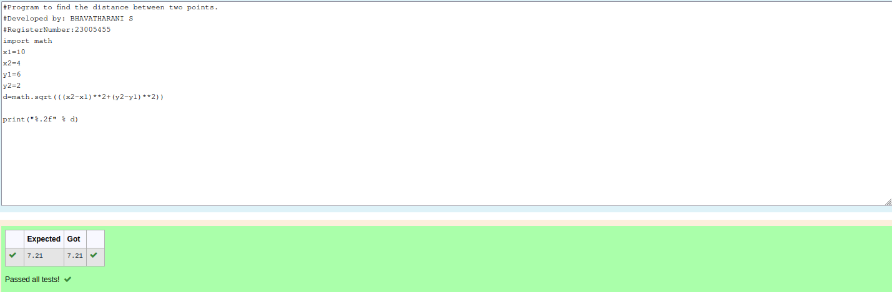

# DISTANCE-BETWEEN-TWO-POINTS

## AIM:
To write a python program to find the distance two 2 points
## ALGORITHM:
### Step 1:  
Start the program
### Step 2: 
write the program appropirately
### Step 3: 
Substitute the values in the distance formula  
### Step 4: 
Commit and push to github
### Step 5: 
Share the repository link
### PROGRAM:
 ```
 #Program to find the distance between two points.
#Developed by: BHAVATHARANI S
#RegisterNumber:23005455
import math
x1=10
x2=4
y1=6
y2=2
d=math.sqrt(((x2-x1)**2+(y2-y1)**2))
print("%.2f" % d) 
```


### OUTPUT:



### RESULT:
The distance between two points are executed sucessfully.
